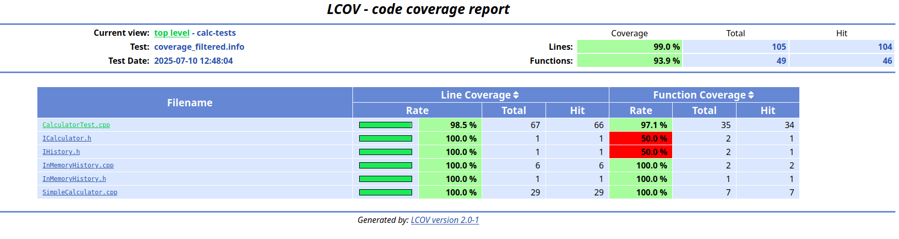

---

##  Сборка и запуск тестов
Проект использует CMake и GTest. Для сборки и запуска:

bash
Копировать
Редактировать
mkdir build
cd build
cmake ..
cmake --build .
./Calculator_test

##  Генерация покрытия кода
Скрипт cov.sh автоматизирует полный процесс:

Удаляет старую сборку

Пересобирает проект

Запускает тесты

Генерирует покрытие (lcov)

Удаляет шум от STL и GTest

Создаёт HTML-отчёт

Автоматически открывает его в браузере

## Запуск:
./cov.sh

## Результат покрытия
После выполнения скрипта:

В каталоге build/coverage_report/ появляется HTML-отчёт

Он автоматически откроется в браузере (xdg-open)

Внутри видны:

Общий процент покрытия 

Какие файлы и строки покрыты

## Пример отчёта

##  Зависимости
Используются lcov, gcov, genhtml, GTest, CMake.

sudo apt update
sudo apt install -y build-essential cmake lcov gcovr
